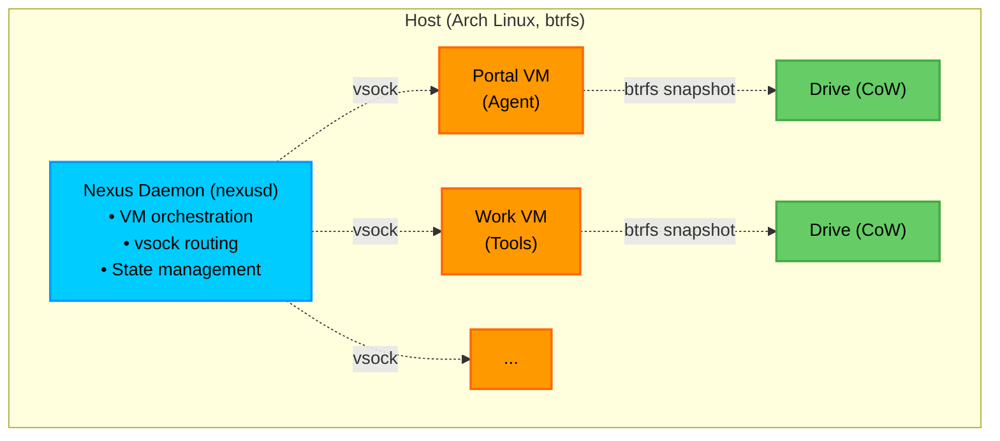

# Introduction

WorkFort is infrastructure for AI agents. Each agent gets its own Firecracker microVM — a private workspace with full system access — managed by the Nexus daemon.

## What is WorkFort?

AI agent frameworks give agents chat and tools. WorkFort gives them a computer.

WorkFort provides:
- **Firecracker microVMs** for hardware-level isolation (not containers)
- **btrfs workspaces** for instant snapshots and rollback
- **vsock communication** for secure host-VM messaging
- **Centralized control** via Nexus daemon for observability and policy

Each agent runs in its own microVM with its own kernel, filesystem, and network stack. True isolation that containers can't match.

## Architecture

## Components

### Nexus Daemon (`nexusd`)
- Manages VM lifecycle (create, start, stop, destroy)
- Routes vsock messages between VMs
- Tracks state in SQLite
- Enforces security policies

### Nexus CLI (`nexusctl`)
- Command-line interface for Nexus
- Communicates with daemon via HTTP
- Manages VMs, images, and workspaces

### Guest Agent
- Runs inside Work VMs
- Exposes MCP (Model Context Protocol) tools
- Provides file operations, command execution
- No credentials — all auth happens in Nexus

## Why Firecracker?

Firecracker provides hypervisor-level isolation:
- Each VM has its own kernel
- No shared kernel namespaces
- No container escape vectors
- Lightweight: boots in ~125ms

Docker and containers share the host kernel. WorkFort gives each agent its own kernel for true isolation.

## Status

WorkFort is in alpha development. The Nexus daemon can boot Firecracker VMs with Alpine Linux rootfs. Guest agent and MCP tool routing are in progress.

Follow development in the [DevLog](/blog).

## Next Steps

- Check the [GitHub repository](https://github.com/Work-Fort/Nexus) for source code
- Join the [Discord](https://discord.gg/WMAHUG8RkN) community
- Read the [DevLog](/blog) to follow development progress
